  

<!-- Navbar -->

  

 

<!-- ============ 01 ABOUT ============ -->

  

<!-- ============ 02 SERVICES ============ -->

  

<!-- ============ 03 TECH STACK ============ -->

**📱 Mobile & Frontend**

**🗄️ Backend & Databases**

**🤖 AI, Automation & Tools**

 

<!-- ============ 04 GITHUB ============ -->

 

<picture>
  <source media="(prefers-color-scheme: dark)" srcset="https://raw.githubusercontent.com/fasilfaz/fasilfaz/output/github-snake-dark.svg" />
  
</picture>

  

<!-- ============ 05 CONTACT ============ -->

 

 

